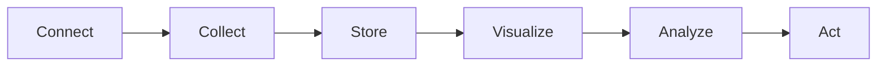
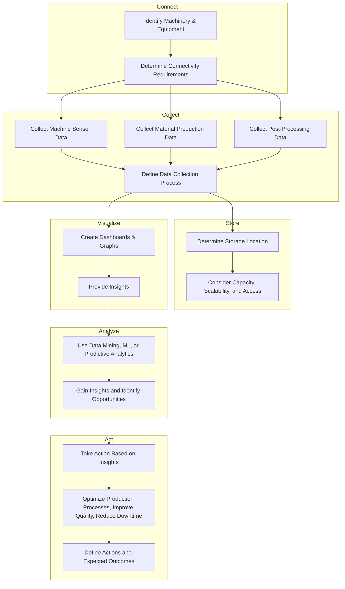

# IOT Strategy

## Connect
Identify the machinery and equipment that need to be connected, including production equipment, 3D printers, and post-processing equipment. Determine the necessary connectivity requirements and security protocols for each data source.

## Collect
Collect valuable data from the three major data sources: material production data, machine sensor data during 3D printing, and data from cleaning and thermal post-processing and sintering. Define the data collection process for each data source.

## Store
Determine where to store the data from the three major data sources, considering capacity, scalability, and data access requirements for each data source.

## Visualize
Create visualizations, such as dashboards and graphs, that provide insights into the data from the three major data sources.

## Analyze
Use data mining, machine learning, or predictive analytics to gain insights and identify opportunities for optimization for each of the three major data sources.

## Act
Take action based on the insights gained from data analysis for each of the three major data sources, such as optimizing production processes, improving product quality, or reducing downtime. Define the actions to be taken and expected outcomes for each data source.

!!! info  "Lorem ipsum" 
	Lorem ipsum dolor sit amet, consectetur adipiscing elit. Nulla et euismod nulla. Curabitur feugiat, tortor non consequat finibus, justo purus auctor massa, nec semper lorem quam in massa.

---

